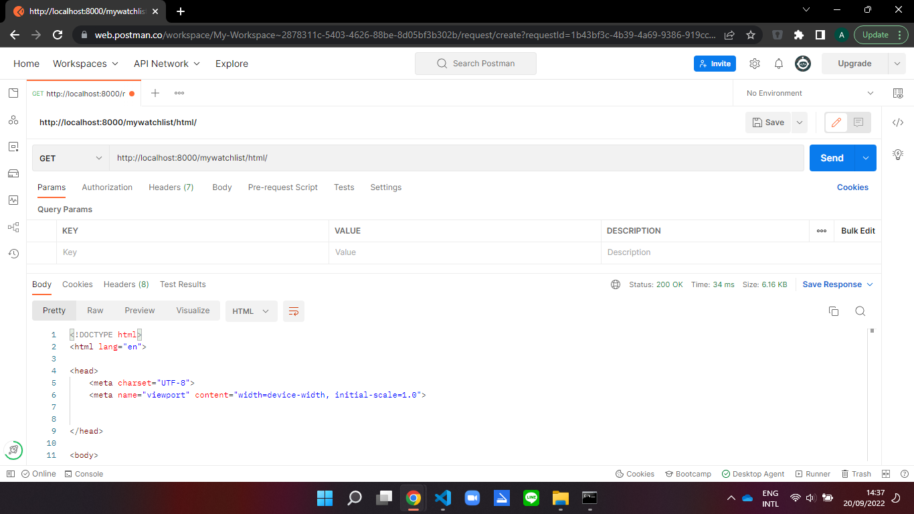

# Tugas 2 Assignment PBP

### Link HTML: https://tugas-2-pbp-airel.herokuapp.com/mywatchlist/html
### Link JSON: https://tugas-2-pbp-airel.herokuapp.com/mywatchlist/json
### Link XML: https://tugas-2-pbp-airel.herokuapp.com/mywatchlist/xml

***

## Perbedaan JSON, XML, dan HTML
| JSON | XML | HTML |
| ----------- | ----------- | ----------- |
| Sebuah data format | Sebuah bahasa extensible markup | Sebuah bahasa markup |
| Berdasarkan bahasa pemrograman JavaScript | Berasal dari SGML | Berasal dari SGML |
| Digunakan untuk menyimpan dan transfer data | Digunakan untuk menyimpan dan transfer data | Digunakan untuk menampilkan data  |
| Data direpresentasikan dengan *key-value pair* | Data direpresentasikan dengan *user defined tags* | Struktur halaman web direpresentasikan dengan *predefined tags* |
| Menggunakan JSON.parse() dalam *parsing* JSON string| Menggunakan XML DOM untuk *looping* dokumen | Menggunakan HTML DOM untuk *looping* dokumen |

## Mengapa Memerlukan *Data Delivery*
Diperlukannya *data delivery* ketika implementasi sebuah platform karena ada saatnya kita memerlukan mengirim data yang kita punya dari satu *stack* ke *stack* yang lainnya. Ada tiga format data dari *data delivery*, yaitu HTML, XML, dan JSON.

## Implementasi

1. Membuat Aplikasi `mywatchlist`
   
   Membuat aplikasi baru di Django dengan nama `mywatchlist` dengan mengetik kode:
   ```shell
   python manage.py startapp mywatchlist
   ```

   Kemudian membuka `settings.py` di folder `project_django` dan menambahkan aplikasi `mywatchlist` ke dalam variabel `INSTALLED_APPS`.

   ```shell
   INSTALLED_APPS = [
      ...,
      'mywatchlist',
   ]
   ```

2. Menambah Path `mywatchlist`
   
   Menambahkan potongan kode di bawah ini di `project_django\urls.py`  agar dapat mengakses http://localhost:8000/mywatchlist:
   ```shell
   ...
   path('mywatchlist/', include('mywatchlist.urls'))
   ...
   ``` 

3. Membuat Model `MyWatchlist`
   
   Membuat class `MyWatchlist` di `models.py` dan di dalamnya ada beberapa atribut, yaitu `watched` dengan tipe `Boolean`, `title` dengan tipe `Character` dan panjang kata maksimum 50 kata, `rating` sebuah `Integer`, atribut `release_date` bertipe `Date`, dan `review` bertipe `Text`.
   ```shell
   class MyWatchList(models.Model):
      watched = models.BooleanField()
      title = models.CharField(max_length=50)
      rating = models.IntegerField()
      release_date = models.DateField()
      review = models.TextField()
   ```

4. Menambahkan Minimal 10 Data Objek `MyWatchlist`

   Membuat folder baru bernama `fixtures` dan membuat file di dalam folder tersebut bernama `initial_mywatchlist_data.json`. Kemudian, masukkan data-data beserta atributnya. Jangan lupa untuk menjalankan beberapa perintah di bawah untuk migrasi skema model dan memasukkan data `initial_mywatchlist_data.json` ke dalam *database* Django lokal.
   ```shell
   python manage.py makemigrations
   python manage.py migrate
   python manage.py loaddata initial_mywatchlist_data.json
   ```

5. Implementasi Fitur Penyajian Data

   * HTML

      Membuat kode di bawah ini di `views.py` untuk me-*render* gabungan dari file template HTML dengan `context` yang berisi semua data `MyWatchList`, nama, dan npm.
      ```shell
      from mywatchlist.models import MyWatchList

      def show_html(request):
         data = MyWatchList.objects.all()
         context = {
            'list_mywatchlist': data,
            'name': 'Airel Camilo Khairan',
            'id': '2106652581'
         }
         
      return render(request, "mywatchlist.html", context)
      ```

      Kemudian, memetakan `context` ke dalam `templates\mywatchlist` dengan sintaks Django.
      ```shell
      <h5>Name: </h5>
      <p>{{name}}</p>

      <h5>Student ID: </h5>
      <p>{{id}}</p>
      ...
         
         <tr>
            
               <td>Watched</td>
            
               <td>Haven\'t Watched</td>
            
            <td>{{item.title}}</td>
            <td>{{item.rating}}</td>
            <td>{{item.release_date}}</td>
            <td>{{item.review}}</td>
         </tr>
         
      ...
      ```

   * XML

      Masih di dalam `views.py`, import HttpResponse dan Serializers lalu membuat sebuah fungsi untuk mengubah data `MyWatchList` ke dalam bentuk `XML` dengan mengeksekusi fungsi serialize. Kemudian, mengembalikan data ke dalam bentuk `HTTPResponse`
      ```shell
      from django.http import HttpResponse
      from django.core import serializers

      def show_xml(request):
         data = MyWatchList.objects.all()
         return HttpResponse(serializers.serialize("xml", data), content_type="application/xml")
      ```

   * JSON

      Membuat sebuah fungsi untuk mengubah data `MyWatchList` ke dalam bentuk `JSON` dengan mengeksekusi fungsi serialize. Kemudian, mengembalikan data ke dalam bentuk `HTTPResponse`
      ```shell
      def show_json(request):
         data = MyWatchList.objects.all()
         return HttpResponse(serializers.serialize("json", data), content_type="application/json")
      ```

6. Membuat Routing URL

   Di dalam `urls.py` implementasi routing URL ke http://localhost:8000/mywatchlist/html untuk mengakses dalam bentuk HTML, http://localhost:8000/mywatchlist/xml untuk mengakses dalam bentuk XML, dan http://localhost:8000/mywatchlist/json untuk mengakses dalam bentuk JSON
   ```shell
   from mywatchlist.views import show_html
   from mywatchlist.views import show_xml
   from mywatchlist.views import show_json

   app_name = 'mywatchlist'

   urlpatterns = [
      path('html/', show_html, name='show_html'),
      path('xml/', show_xml, name='show_xml'),
      path('json/', show_json, name='show_json'),
   ]
   ```

7. *Deployement* Ke Heroku

   Karena *repository* ini sudah di *deploy* untuk Tugas 2, tidak perlu mengulang membuat aplikasi di Heroku dan menambah Secret ke *repository*. Tetapi ada beberapa hal yang perlu diubah:
   * Di file `Procfile`
   
   Menambahkan potongan kode berikut.
   ```shell
   release: sh -c 'python manage.py migrate && python manage.py loaddata initial_catalog_data.json && python manage.py loaddata initial_mywatchlist_data.json'
   ```
   Tinggal mengakses halaman web sesuai url-nya, yaitu https://tugas-2-pbp-airel.herokuapp.com/mywatchlist/html, https://tugas-2-pbp-airel.herokuapp.com/mywatchlist/json, dan https://tugas-2-pbp-airel.herokuapp.com/mywatchlist/xml


***

## Mengakses URL dengan Postman
1. HTML

   

2. XML

   

3. JSON

   

***

## Menambah Unit Test
Di dalam `mywatchlist\tests.py` menambah potongan kode di bawah ini untuk mengecek apakah setiap URL, yaitu ` http://localhost:8000/mywatchlist/html`, ` http://localhost:8000/mywatchlist/xml`, ` http://localhost:8000/mywatchlist/json` ada atau tidak. Apabila ada path url tersebut, maka akan mengembalikan respon `HTTP 200 OK`.

Khusus untuk HTML agar tidak error, hapus `  <link rel="stylesheet" href="">` di `project_django\templates\base.html`.
```shell
from django.test import TestCase, Client

class MyWatchListTest(TestCase):
    def test_html_url_exists(self):
        response = Client().get('/mywatchlist/html/')
        self.assertEqual(response.status_code, 200)
    
    def test_xml_url_exists(self):
        response = Client().get("/mywatchlist/xml/")
        self.assertEqual(response.status_code, 200)

    def test_json_url_exists(self):
        response = Client().get("/mywatchlist/json/")
        self.assertEqual(response.status_code, 200)
```

***

## Bonus
Di dalam `views.py` pertama-tama, masukkan semua data film yang ditonton dan yang belum ditonton ke variabelnya masing-masing, yaitu `data_watched` dan `data_havent_watched`. Kemudian mencari apakah jumlah data film yang ditonton lebih besar atau sama dengan jumlah data film yg belum ditonton ke variabel `watched_a_lot`.
```shell
data_watched = MyWatchList.objects.filter(watched=True)
data_havent_watched = MyWatchList.objects.filter(watched=False)
watched_a_lot = data_watched.count() >= data_havent_watched.count()
```

Variabel `watched_a_lot` bertipe `Boolean` dimasukkan ke dictionary `context` agar di-*render* ke *template* `mywatchlist.html`
```shell
context = {
        ...
        'watched_a_lot': watched_a_lot,
        ...
    }
    return render(request, "mywatchlist.html", context)
```

Terakhir, di `mywatchlist.html` buat kode *if-statement*-nya di bawah Student ID.
```shell

    <h3>Selamat, kamu sudah banyak menonton!</h3>

    <h3>Wah, kamu masih sedikit menonton!</h3>

```

Sehingga saat membuka https://tugas-2-pbp-airel.herokuapp.com/mywatchlist/html/, di bawah Student ID akan menampilkan pesan yang sesuai.

***

## Credits
Sumber jawaban perbedaan JSON, XML, dan HTML [HTML vs XML](https://www.geeksforgeeks.org/html-vs-xml/) dan [Difference between JSON and XML](https://www.geeksforgeeks.org/difference-between-json-and-xml/)

Sumber jawaban *data delivery* [Lab 2 - PBP Ganjil 22/23](https://pbp-fasilkom-ui.github.io/ganjil-2023/assignments/tutorial/tutorial-2)

***

## Previous Assignment
<details>
  <summary>Tugas 1</summary>

# Tugas 1 Assignment PBP

### Link Heroku App: https://tugas-2-pbp-airel.herokuapp.com/katalog

***

## Bagan Urls, Views, Models, dan Template
Bagan yang berisi *request client* ke web aplikasi berbasis Django beserta responnya dan kaitan antara `urls.py`, `views.py`, `models.py`, dan berkas `html`


Ketika pengguna meminta suatu halaman website, URL router `urls.py` akan mencocokan *path* permintaan tersebut dengan pola URL yang tersedia. Apabila ada yang cocok, `urls.py` akan meneruskannya ke `views.py` yang sesuai. `views.py` merupakan logika dari suatu halaman web yang akan memanggil `models.py` apabila membutuhkan *read/write* data dari *database*. Setelah permintaan diproses, `views.py` akan memetakan data dari *database* ke dalam berkas template `HTML`. Barulah template `HTML` tersebut dapat ditampilkan ke pengguna sebagai respons.

***
## Alasan Menggunakan Virtual Environment
Virtual environment adalah sebuah folder yang dibutuhkan untuk menjalankan Python yang ringan dan terisolasi.

Manfaat menggunakan virtual environment, yaitu:
1. Dapat meng-*install* lebih dari satu versi *package*. Misalkan kita membuat dua aplikasi yang membutuhkan versi Django yang berbeda, jika tidak menggunakan virtual environment, versi Django yang baru di *install* akan menjadi versi yang default sehingga susah untuk mengerjakan dua aplikasi tersebut.

2. Agar *package* yang di install hanya *package* yang diperlukan saja. Jika tidak menggunakan virtual environment, *package* yang dibutuhkan di projek lain mungkin dapat memengaruhi pembuatan aplikasi Django secara tidak sengaja.

Sebenarnya pembuatan aplikasi Django tanpa menggunakan virtual environment dibolehkan, tetapi tidak dianjurkan karena kita jadi tidak dapat meng-*install* lebih dari satu versi *package*, akan muncul masalah *dependencies*, dan *package* yang telah di-*install* untuk projek lain dapat memengaruhi jalannya Django.

***
## Implementasi
1. Membuat sebuah fungsi pada `views.py` untuk melakukan pengambilan data dari model dan dikembalikan ke HTML.
   * Sebelumnya, menjalankan beberapa perintah di bawah untuk migrasi skema model dan memasukkan data `initial_catalog_data.json` ke dalam *database* Django lokal.
      ```shell
      python manage.py makemigrations
      python manage.py migrate
      python manage.py loaddata initial_catalog_data.json
      ```

   * Lanjut ke potongan kode `views.py`:
      ```shell
      from katalog.models import CatalogItem

      def show_katalog(request):
         data_katalog = CatalogItem.objects.all()
         context = {
            'list_katalog': data_katalog,
            'name': 'Airel Camilo Khairan',
            'id': '2106652581'
         }
         return render(request, "katalog.html", context)
      ```
      Penjelasan: Pertama melakukan *import* class `CatalogItem` dari file `models.py`. Kemudian, *assign* variabel `data_katalog` dengan semua data `CatalogItem` yang ada dan dimasukkan ke dictionary `context` bersama nama dan npm. Terakhir, memasukkan `context` sebagai argumen dari fungsi `render`. Fungsi `render` berfungsi untuk menggabungkan file template HTML dengan `context` dan menghasilkan objek `HttpResponse`.

2. Membuat routing untuk memetakan fungsi pada `views.py`
   * Berikut potongan kode `urls.py` di folder `project_django`:
      ```shell
      ...
      path('katalog/', include('katalog.urls'))
      ...
      ```
      Penjelasan: Menambahkan potongan kode tersebut, agar ketika membuka http://localhost:8000/katalog/ akan menjalankan kode `urls.py` di folder `katalog`. 
      
   * Selanjutnya di `urls.py` folder `katalog` menambahkan potongan kode ini.
      ```shell
      from katalog.views import show_katalog

      app_name = 'katalog'

      urlpatterns = [
         path('', show_katalog, name='show_katalog'),
      ]
      ```
      Penjelasan: Saat membuka http://localhost:8000/katalog/, potongan kode tersebut akan menjalankan fungsi `show_katalog` yang berada di `views.py`

3. Memetakan data ke dalam HTML dengan sintaks dari Django.
   * Mengganti kata *Fill me!* di bawah *Name* dan *Student ID:* dengan data `name` dan `id` yang tersedia di `context`.
      ```shell
      <h5>Name: </h5>
      <p>{{name}}</p>

      <h5>Student ID: </h5>
      <p>{{id}}</p>
      ```
   
   * Kemudian, menambahkan *for loop* di bawah comment untuk menampilkan baris tabel baru yang berisi setiap `item` di dalam `list_katalog`. Setiap baris berisi data nama, harga, stok, deskripsi, serta link url dari item tersebut.
      ```shell
      
      <tr>
         <td>{{item.item_name}}</td>
         <td>{{item.item_price}}</td>
         <td>{{item.item_stock}}</td>
         <td>{{item.rating}}</td>
         <td>{{item.description}}</td>
         <td>{{item.item_url}}</td>
      </tr>
      
      ```

4. Melakukan `deployment` ke Heroku
   1. Log in ke akun Heroku.
   2. Klik tombol `New -> Create new app`.
   3. Masukkan nama app, yaitu `tugas-2-pbp-airel` dan klik `Create app`.
   4. Klik `Account settings` dan copy `API key`.
   5. Masuk ke repository github `https://github.com/airelcamilo/tugas-2-pbp`.
   6. Klik `Settings -> Secrets -> Actions -> New repository secret`.
   7. Buat variabel `HEROKU_API_KEY` dan masukkan `API key` yang di copy tadi serta variabel `HEROKU_APP_NAME` dan masukkan nama app, yaitu `tugas-2-pbp-airel`.
   8. Selesai, aplikasi dapat diakses di `https://tugas-2-pbp-airel.herokuapp.com/katalog`.

***
## Credits

Memanfaatkan template dari [Github PBP Ganjil 22/23](https://github.com/pbp-fasilkom-ui/assignment-repository)

Sumber jawaban pertanyaan nomor 1 [Django: Request/Response Cycle](https://medium.com/@ksarthak4ever/django-request-response-cycle-2626e9e8606e) dan [Lab 1 - PBP Ganjil 22/23](https://pbp-fasilkom-ui.github.io/ganjil-2023/assignments/tutorial/tutorial-1)

Sumber jawaban pertanyaan nomor 2 [Real Python - Python Virtual Environments: A Primer](https://realpython.com/python-virtual-environments-a-primer/#why-do-you-need-virtual-environments)

</details>
